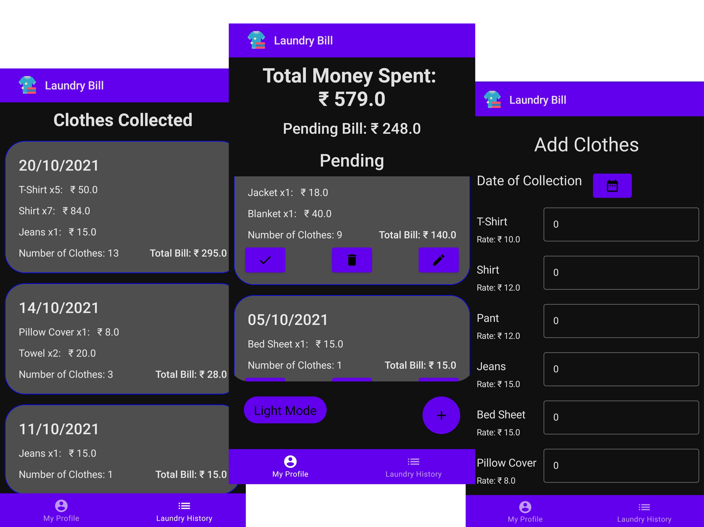
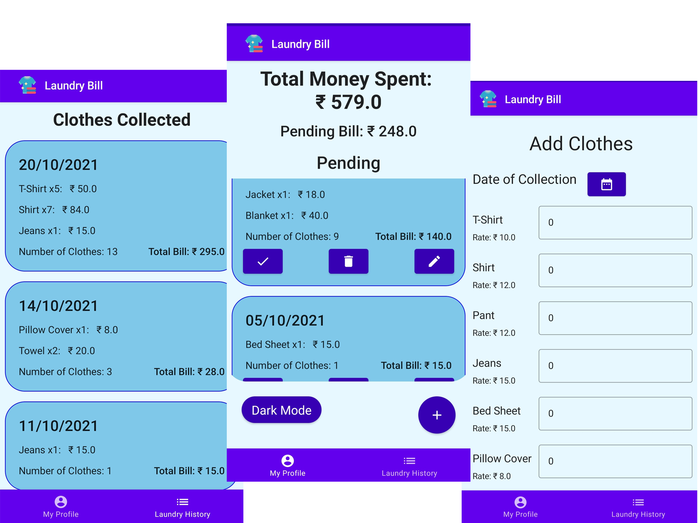

<h1 align='center'>  Laundry Bill </h1>

**Laundry Bill** is a Laundry Management App for Hostelers. It is made for Android devices. The app is developed as a submission for the Round 3 of the induction of **[cruX](https://github.com/crux-bphc)**, The Programming & Computing Club of **[BITS Pilani, Hyderabad Campus](https://www.bits-pilani.ac.in/hyderabad/)**.

## Features
- Adds Laundry Item (Collection Date, Type of Cloth and the Bill)
- Stores the Data Entered and shows Pending Collections
- Also show history of clothes given, the Total Amount Paid and the Pending Amount to be given
- Has both Dark and Light Mode Support
- Notifies the date of collection

## Dark Mode UI

## Light Mode UI

## Installation

1. **Clone the Project:**
    1. Run ` git clone https://github.com/Code-R57/LaundryBill.git ` in terminal
    1. Android Studio -> File -> Open
    1. Connect your Android Device and Run the program (Developer Mode of the Device should be enabled) 
    
## Libraries

- [Coroutines](https://kotlinlang.org/docs/coroutines-overview.html) - For managing background threads
- Jetpack
    - [Compose](https://developer.android.com/jetpack/compose/documentation) - Modern toolkit for building native Android UI
    - [ViewModel](https://developer.android.com/topic/libraries/architecture/viewmodel) - Store and manage UI-related data in a lifecycle conscious way
    - [LiveData](https://developer.android.com/topic/libraries/architecture/livedata) - Observable data holder class
    - [Navigation](https://developer.android.com/guide/navigation) - Implements in-app navigation
    - [Room](https://developer.android.com/training/data-storage/room) - Provides an abstraction layer over SQLite to allow fluent database access while harnessing the full power of SQLite

## Resources

- [Jetpack Compose Documentation](https://developer.android.com/jetpack/compose/documentation)
- [CodingWithMitch Compose Playlist](https://www.youtube.com/playlist?list=PLgCYzUzKIBE_I0_tU5TvkfQpnmrP_9XV8)
- [Foxandroid Notification using AlarmManager](https://www.youtube.com/watch?v=n9FN0odXqi0)
- And Many More Articles, Documentations, Repositories and Videos

Logo Author: [Smashicons](https://www.flaticon.com/authors/smashicons)